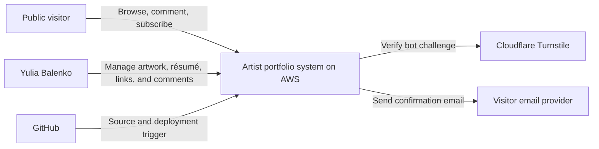
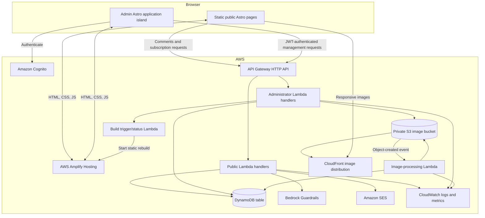
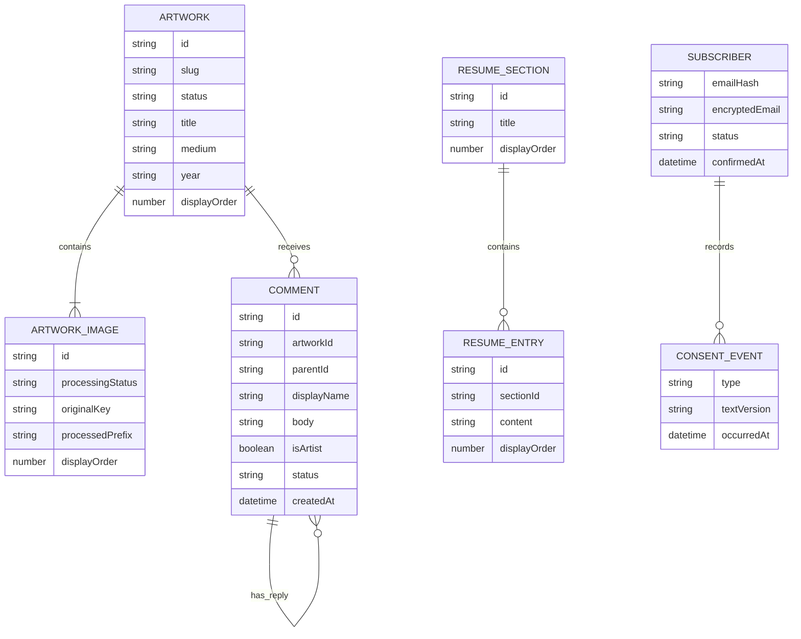
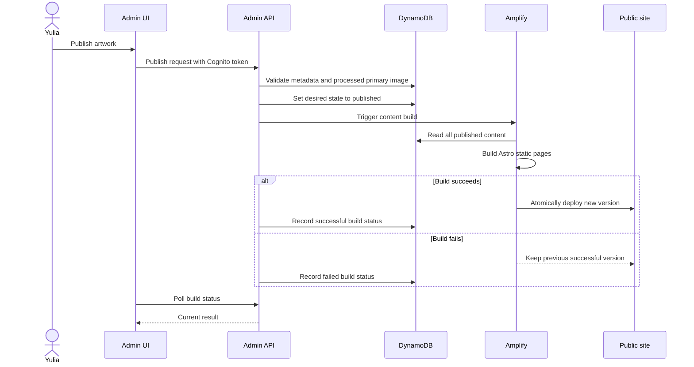
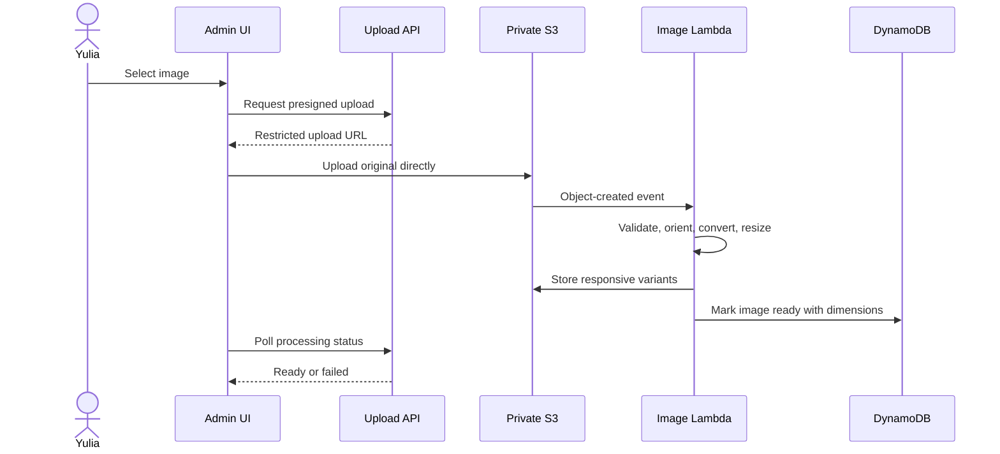
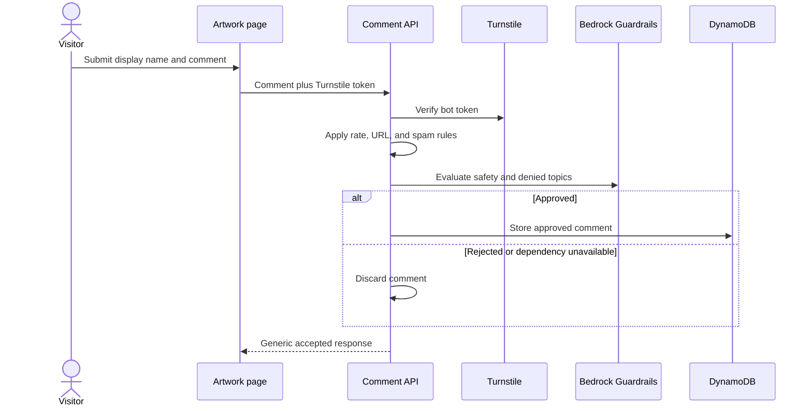

# Yulia Balenko Artist Portfolio — High-Level Design

**Status:** Draft v0.1  
**Date:** June 22, 2026  
**Related documents:** [Business Requirements](./BUSINESS_REQUIREMENTS.md), [Technical Requirements](./TECHNICAL_REQUIREMENTS.md)  
**Architecture style:** Static-first serverless web application on AWS

## 1. Purpose

Describe the proposed P0 system structure, major components, responsibilities, data flows, security boundaries, deployment model, and important architectural tradeoffs.

Detailed behavioral constraints and acceptance criteria remain in the [Technical Requirements](./TECHNICAL_REQUIREMENTS.md). This document describes how the selected components satisfy them.

## 2. Architecture goals

- Keep normal operating cost between $0 and $5 USD per month, excluding the domain.
- Deliver artwork pages quickly from a global CDN.
- Produce complete HTML for public content and search engines.
- Support content editing without requiring Yulia to change code.
- Keep original artwork uploads private.
- Isolate public forms from administrator capabilities.
- Use managed and serverless services to minimize maintenance.
- Keep the design appropriate for one administrator and approximately 100 artworks.

## 3. Constraints and assumptions

- Astro, TypeScript, and AWS have been selected.
- There is one administrator.
- Public content changes infrequently enough for a short rebuild after publishing to be acceptable.
- Comments and subscription activity must work without rebuilding the public site.
- P0 does not include commerce, visitor accounts, video, analytics, or newsletter campaigns.
- The default AWS region is `us-west-2`, subject to confirming required service availability.
- Cloudflare Turnstile is the only proposed non-AWS runtime dependency.

## 4. Key architecture decisions

| Concern | Decision | Rationale |
|---|---|---|
| Rendering | Static Astro build | Fast public pages, strong SEO, minimal runtime cost |
| Web hosting | AWS Amplify Hosting | Git integration, managed builds, CDN delivery, atomic deployments |
| Dynamic behavior | API Gateway HTTP API and Lambda | Serverless comments, subscriptions, uploads, and administration |
| Content storage | DynamoDB | Low administration, small workload, flexible content entities |
| Image storage | Private S3 | Durable storage and direct browser uploads through presigned URLs |
| Image delivery | CloudFront over processed S3 objects | CDN caching without exposing original uploads |
| Authentication | Cognito | Managed single-administrator authentication and JWT issuance |
| Email | SES | Low-cost confirmation and unsubscribe-related email |
| Moderation | Rules plus Bedrock Guardrails | Deterministic spam rejection plus managed safety/topic policies |
| Bot control | Turnstile | No fixed AWS WAF cost for a low-volume personal site |
| Infrastructure | AWS CDK in TypeScript | Repeatable, reviewable AWS configuration in the project language |

### 4.1 Static rendering decision

Amplify supports static Astro sites directly. Server-rendered Astro on Amplify currently depends on a community-maintained adapter rather than one maintained by AWS. P0 avoids that dependency.

Public content is compiled into Astro pages. Publishing content triggers a new Amplify build. Amplify keeps the previous successful deployment online until the new build succeeds.

Dynamic comments are loaded from the API after the primary artwork HTML. They therefore appear immediately after approval and do not require a content rebuild.

## 5. System context

## 6. Container architecture

## 7. Component responsibilities

### 7.1 Astro public site

- Generates the home, gallery, artwork, About, résumé, and privacy pages.
- Reads published content from DynamoDB during the Amplify build.
- Generates metadata, canonical URLs, sitemap, and robots rules.
- Provides small interactive components for filtering, image viewing, comments, and signup.
- Contains no AWS credentials or private content.

### 7.2 Astro administration interface

- Runs as a protected client-side area within the same deployed site.
- Authenticates through Cognito using an authorization-code flow with PKCE.
- Calls administrator API routes with a Cognito access token.
- Manages artwork, uploads, résumé sections, public links, comments, and subscribers.
- Displays image-processing and content-build status.

The administration JavaScript itself may be downloaded publicly, but no administration data or action is available without a valid token. Authorization is enforced by the API, not merely by hiding the route.

### 7.3 API Gateway

- Exposes one HTTPS API origin.
- Routes public and administrator operations to separate Lambda handlers.
- Validates Cognito JWTs for administrator routes.
- Applies CORS, payload limits, throttling, and request routing.
- Allows requests only from the configured portfolio origins where browser CORS applies.

### 7.4 Lambda functions

Functions are separated by responsibility and IAM permissions:

- **Content administration:** artwork, profile, résumé, and public-link changes.
- **Upload coordination:** validates metadata and creates short-lived S3 presigned URLs.
- **Image processing:** validates uploads and creates responsive variants.
- **Comment read/write:** retrieves approved threads and processes new submissions.
- **Subscription:** signup, confirmation, unsubscribe, and export.
- **Comment administration:** hide, restore, delete, and artist reply.
- **Build coordination:** triggers Amplify and reports build status.

No Lambda receives unrestricted access to all AWS resources.

### 7.5 DynamoDB

One P0 table stores structured application data. It is the source of truth for:

- Artwork metadata and publication state
- Image order and processing state
- Profile and public links
- Résumé sections and entries
- Approved comments and replies
- Subscriber consent state
- Site and build configuration

Public builds may scan the small content set. Runtime APIs use keyed queries and cursor pagination.

### 7.6 S3 and CloudFront

The S3 bucket is private and logically separated into:

- `originals/` — private source uploads
- `processed/` — public-display variants accessible only through CloudFront
- `backups/` — protected exports when required

CloudFront uses Origin Access Control. Original objects have no public delivery path. Processed keys are versioned so they can be cached for a long time.

### 7.7 Cognito

- Contains one manually provisioned administrator.
- Disables public registration.
- Issues tokens used by the administration API authorizer.
- Supports password recovery and TOTP multi-factor authentication.

### 7.8 Bedrock Guardrails and Turnstile

- Turnstile verifies that a comment submission is likely from a human.
- Local rules reject links and obvious spam before paid moderation.
- Bedrock Guardrails evaluates harmful content and denied/off-topic subjects.
- Only approved comments are persisted.
- Moderation failure is fail-closed.

### 7.9 SES

- Sends double-opt-in confirmation messages.
- Sends operational unsubscribe-related messages when needed.
- Uses the verified portfolio domain with SPF, DKIM, and DMARC.
- Does not send newsletter campaigns in P0.

## 8. Data design

### 8.1 Logical entities

This is a logical view, not a requirement to create separate DynamoDB tables. The physical design uses one table with composite keys and only necessary secondary indexes.

### 8.2 Consistency model

- DynamoDB is authoritative for current content and state.
- The public static site is a deployed snapshot of published content.
- Build status records which snapshot is currently deployed.
- Comments are runtime data and are always read from DynamoDB.
- S3 object state and DynamoDB image state are reconciled by the image-processing function.

## 9. Primary flows

### 9.1 Publish artwork

The exact build-completion status integration may use Amplify APIs or events. This must be validated during the deployment proof of concept.

### 9.2 Upload and process an image

### 9.3 Submit a comment

### 9.4 Mailing-list signup

1. Visitor submits email and optional name.
2. Subscription Lambda normalizes and hashes the email.
3. A pending subscriber and hashed, expiring token are stored.
4. SES sends a confirmation link.
5. Visitor follows the link.
6. Subscription Lambda validates the token and records confirmed consent.
7. Unsubscribe uses a separate single-purpose link and changes subscriber state.

## 10. Security design

### 10.1 Trust boundaries

- The public browser is untrusted.
- API Gateway is the only public entry point for application data operations.
- Cognito identity is required for every administrator operation.
- Lambda roles define access to DynamoDB, S3, SES, Bedrock, and Amplify.
- Original S3 objects remain inside the AWS trust boundary.
- Turnstile verification is an outbound server call; a browser result alone is never trusted.

### 10.2 Controls

- Cognito authorization-code flow with PKCE and TOTP MFA.
- API Gateway JWT authorizer on administrator routes.
- Server-side validation for every request.
- Short-lived, narrowly scoped S3 presigned URLs.
- Private S3 bucket with public access blocked.
- CloudFront Origin Access Control for processed images.
- CORS restricted to known portfolio origins.
- Security response headers on public and administration pages.
- API throttles and reserved Lambda concurrency.
- No request bodies, emails, comment text, or tokens in logs.
- Secrets held in Parameter Store or Secrets Manager.

## 11. Deployment design

### 11.1 Application deployment

- GitHub contains the Astro application, Lambda packages, shared schemas, tests, and CDK code.
- Pull requests run checks without deploying production.
- A merge to the production branch triggers Amplify.
- Amplify installs dependencies, reads published DynamoDB content using a read-only service role, runs `astro build`, and deploys the output.
- Content publishing invokes an incoming Amplify webhook or an equivalent IAM-authenticated build operation.

### 11.2 Infrastructure deployment

AWS CDK defines:

- DynamoDB table and indexes
- S3 bucket, event notification, lifecycle, and access policies
- CloudFront image distribution
- API Gateway routes and authorizers
- Lambda functions and IAM roles
- Cognito User Pool and application client
- SES-related configuration that can be automated
- Bedrock Guardrail configuration where supported by CDK/CloudFormation
- CloudWatch retention, alarms, and budget notifications

Manual account-level actions such as domain registration, SES production approval, DNS verification, and initial administrator enrollment are documented separately.

### 11.3 Environment strategy

- Local development uses local Astro plus mocked or sandbox service integrations.
- P0 has one persistent AWS production environment.
- Temporary preview environments may be created for major changes and destroyed afterward.
- Resource names and tags identify application, environment, and owner.

## 12. Reliability and operations

- Amplify retains the last successful public deployment when a new build fails.
- S3 versioning protects recent original-image changes.
- DynamoDB point-in-time recovery or scheduled export protects structured data.
- CloudWatch records bounded operational logs, error counts, latency, throttling, and build failures.
- No user-behavior analytics are collected.
- The administrator UI exposes operational status needed for image processing and publishing.
- Restore instructions cover content, images, administrator access, and site deployment.

## 13. Cost and scaling

### 13.1 Cost controls

- AWS Budget notifications at $1 and $5 per month.
- API throttling and reserved Lambda concurrency.
- Bounded image sizes and variant counts.
- Short CloudWatch retention.
- No fixed-cost compute, RDS, NAT Gateway, or AWS WAF in P0.
- Deterministic comment rules run before usage-priced Bedrock moderation.
- Content builds occur only for code or public-content changes.

### 13.2 Expected scaling behavior

The design comfortably supports the initial 100 artworks and low-volume discussion. Lambda, API Gateway, S3, CloudFront, Amplify, and DynamoDB can scale beyond that without redesign.

The first likely pressure points are:

- Amplify build frequency if content changes become frequent
- S3 storage for large original images
- Bedrock cost under comment spam
- DynamoDB access patterns if comments become high volume
- Administration usability if multiple artists or administrators are introduced

These are acceptable constraints for the current personal portfolio.

## 14. Alternatives considered

### Astro SSR on Amplify

Rejected for P0 because it requires a community-maintained adapter. It could remove content rebuilds but adds deployment compatibility risk.

### Astro Node server on ECS or Fargate

Rejected because continuously available compute and container operations are unnecessary for this workload and cost target.

### S3 and CloudFront for the complete site

Viable, but Amplify provides a simpler Git-connected build and atomic deployment workflow. CloudFront remains appropriate for the separately managed image origin.

### Amazon RDS or Aurora

Rejected because a relational server is unnecessary for the small access patterns and introduces more cost and administration than DynamoDB.

### AWS WAF CAPTCHA

Rejected for P0 because its fixed web ACL and rule charges conflict with the lowest-cost goal. Turnstile can protect forms independently of the hosting provider.

## 15. Architecture risks

| Risk | Effect | Mitigation |
|---|---|---|
| Static build after publishing | Public update is not immediate | Show build status, retain last successful deployment, allow retry |
| Build failure after unpublish | Old page may remain temporarily visible | Clearly surface failure and provide urgent retry procedure |
| Bedrock false positive | Acceptable comment is discarded | Tune policies with test cases; business decision intentionally provides no review queue |
| Turnstile outage | Comments fail closed | Show generic temporary outcome; artwork browsing remains unaffected |
| DynamoDB single-table complexity | Harder ad hoc inspection | Document keys and access patterns; provide administrator views and exports |
| AWS service sprawl | More configuration than a managed CMS | CDK, least-privilege roles, one region, and bounded P0 components |
| Large originals | Storage and processing cost | Enforce upload limits and inspect representative files before launch |

## 16. Design validation required

Before full implementation, complete a thin proof of concept that demonstrates:

1. Amplify builds a static Astro site using published DynamoDB content.
2. A backend action triggers an Amplify content rebuild and exposes its status.
3. Cognito protects an administrator API route from a static Astro UI.
4. A browser uploads directly to private S3 through a presigned URL.
5. S3 invokes image processing and CloudFront serves only the processed variant.
6. Bedrock `ApplyGuardrail` evaluates a representative comment within the cost and latency target.
7. Turnstile verification works from the Amplify-hosted domain.
8. SES sends a domain-authenticated confirmation email outside the SES sandbox.

## 17. Open design decisions

- Final domain and DNS provider
- Representative image size, format, and processing memory requirement
- Exact Bedrock Guardrail policies and thresholds
- Build-status integration method: Amplify webhook/API polling or event-driven completion
- DynamoDB key schema and required secondary indexes
- Backup choice after measuring PITR cost
- Whether comments are enabled globally or per artwork
- Acceptance of Turnstile as a non-AWS dependency

## 18. References

- [Astro deployment on AWS](https://docs.astro.build/en/guides/deploy/aws/)
- [AWS Amplify support for Astro](https://docs.aws.amazon.com/amplify/latest/userguide/astro-support.html)
- [Amplify incoming build webhooks](https://docs.aws.amazon.com/amplify/latest/userguide/create-incoming-webhook.html)
- [Amazon Bedrock Guardrails ApplyGuardrail](https://docs.aws.amazon.com/bedrock/latest/userguide/guardrails-use-independent-api.html)
- [Secure static sites with S3 and CloudFront](https://docs.aws.amazon.com/AmazonCloudFront/latest/DeveloperGuide/getting-started-secure-static-website-cloudformation-template.html)
