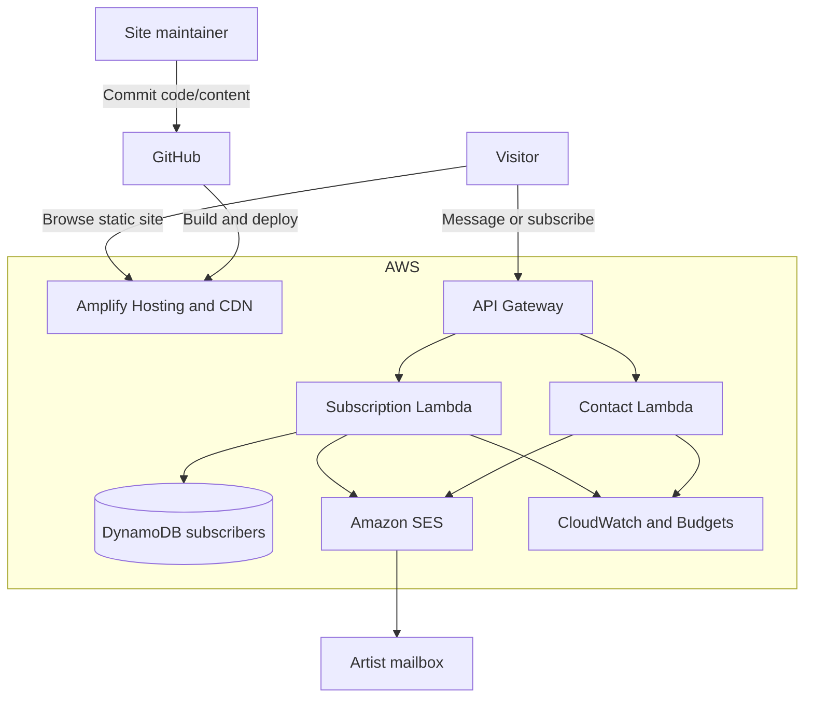
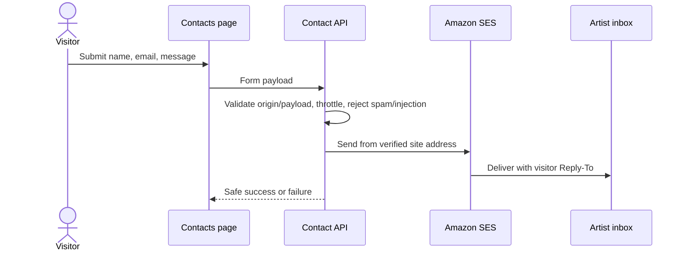
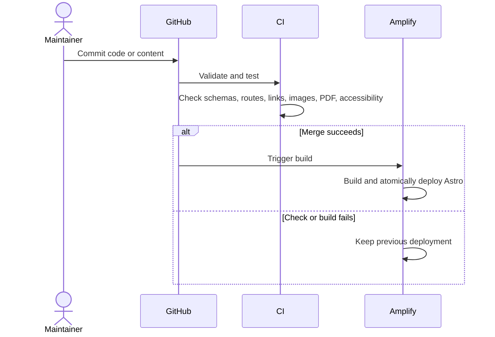

# Yulia Balenko Artist Portfolio — High-Level Design

**Status:** Draft v0.6  
**Updated:** July 19, 2026  
**Related documents:** [Business Requirements](../requirements/business.md), [Technical Requirements](../requirements/technical.md)  
**Style:** Code-managed static website with contact and subscription APIs

## 1. Design summary

Astro compiles Home, Exhibitions, Portfolio, Resume, Contacts, navigation, and Privacy content into a static website. AWS Amplify Hosting builds and distributes it through a CDN.

Home is the default route and contains the artist statement with an optional compact, manually curated Home carousel and artist portrait. Portfolio contains only images and a client-side carousel—no filters, descriptions, or comments.

Only contact delivery and mailing-list enrollment are dynamic. API Gateway and Lambda handle forms, DynamoDB stores subscriber state, and SES delivers contact and subscription email.

The Contacts page currently focuses on Leave a message only. Mailing-list signup is hidden and deferred while protected message delivery is implemented.

## 2. Key decisions

| Concern               | Choice                                    |
| --------------------- | ----------------------------------------- |
| Framework             | Astro and TypeScript                      |
| Public content        | Typed files and assets in GitHub          |
| Hosting               | Static AWS Amplify Hosting                |
| Interactive portfolio | Small accessible carousel component       |
| Dynamic API           | API Gateway HTTP API and Lambda           |
| Runtime data          | DynamoDB for subscriptions only           |
| Email                 | SES for contact and subscription delivery |
| Spam controls         | Honeypot and backend throttling           |
| Infrastructure        | AWS CDK in TypeScript                     |

P0 has no CMS, browser administration, Cognito, comments, Bedrock, upload pipeline, RDS, or continuously running server.

## 3. Architecture



## 4. Static site structure

```text
Home (/)
Exhibitions disabled fallback (/exhibitions)
  └── Current, Past, Upcoming sections remain in code behind feature flag
Portfolio (/portfolio)
Resume navigation → S3 PDF
Resume fallback page (/resume)
Contacts (/contacts)
```

- `/exhibitions` currently renders a disabled/coming-soon fallback while `featureFlags.exhibitions` is `false`.
- When enabled, `/exhibitions` renders Current, Past, and Upcoming as page sections.
- `/exhibitions/current`, `/exhibitions/past`, and `/exhibitions/upcoming` currently redirect to `/exhibitions/`; restoring matching hash redirects can be handled when Exhibitions is re-enabled.
- Contacts contains a linkable Privacy Notice section.
- There is no About or separate Privacy route.
- The shared navigation uses normal links. Resume opens the configured S3-hosted PDF in a new browser tab. Exhibitions is hidden while disabled and does not use a header submenu when re-enabled.

Repository content models are:

- `ArtistStatement`
- `ExhibitionEntry`
- `PortfolioImage`
- `HomeCarouselImage`
- `SiteLinks`
- `PrivacyNotice`
- Résumé PDF URL

Astro validates these models during build. Git history is the source of truth and rollback mechanism.

The public static pages use responsive CSS breakpoints so Home, Portfolio, Resume, Contacts, and the disabled Exhibitions fallback adapt from narrow mobile screens through desktop layouts without requiring a separate mobile application.

## 5. Home carousel design

Home carousel images and the Home artist portrait are managed separately from Portfolio artwork records, but they use the same AWS-hosted image strategy as Portfolio assets. Home carousel files live outside GitHub under the `portfolio/home-carousel/` S3 prefix and are referenced from `src/data/homeCarousel.ts` with public `https` URLs. The Home page aligns the compact carousel and artist portrait as supporting visuals above the artist statement without changing the Portfolio gallery.

## 6. Portfolio design

The Portfolio route is deliberately visual and takes interaction inspiration from the [David Hockney Drawings — 2010s page](https://www.hockney.com/index.php/works/drawings/2010s), without copying its identity or its category/decade navigation:

- Static markup displays one prominent selected image and an ordered thumbnail collection.
- The gallery is organized into Landscapes, Still life, and Other sections.
- Published works appear newest first within each Portfolio section, with manifest order preserved for same-year works.
- Selected artwork displays restrained metadata: name, medium, size, year, and availability status.
- It contains no filters, pricing, commerce, or comments.
- A small client component updates the prominent image and provides carousel behavior.
- URL state preserves and shares the selected image.
- Visible previous, next, and close controls complement keyboard and touch input.
- Focus enters the carousel when opened and returns to the original thumbnail when closed.
- Background content becomes inert while the carousel is open.
- Every image has meaningful alternative text even if no title is shown visually.
- Astro produces responsive variants during the build.
- Off-screen thumbnails load lazily, while only adjacent carousel images are prefetched.

Without JavaScript, the prominent first image and thumbnail collection remain visible; selection and carousel enhancement require JavaScript.

## 7. Dynamic flows

### Contact message



The application does not store contact messages or log personal form content.

The browser form is enabled only when the public contact API URL is configured. Private delivery settings, including the recipient email address and SES sender settings, live outside the repository in backend configuration. Turnstile/CAPTCHA is deferred for the current Leave a message iteration.

The current contact API infrastructure is defined under `infra/contact-form/`. It treats `https://yuliabalenko.com` as the canonical origin and also allows `https://www.yuliabalenko.com` while both domains are active.

### Mailing list

Subscription Lambda stores pending and confirmed consent in DynamoDB. SES sends double-opt-in email. Confirmation and unsubscribe require deliberate actions to prevent automatic link scanners from changing state.

## 8. Component responsibilities

| Component           | Responsibility                                                                                                     |
| ------------------- | ------------------------------------------------------------------------------------------------------------------ |
| Astro               | Static pages, content validation, navigation, section controls, gallery, carousel shell, metadata, Resume PDF link |
| Amplify             | Git-connected build, atomic deployment, CDN, TLS, custom domain                                                    |
| API Gateway         | Form routes, CORS, throttling, payload limits                                                                      |
| Contact Lambda      | Validate, throttle, and forward messages to SES without storage                                                    |
| Subscription Lambda | Double opt-in, unsubscribe, consent, and SES email                                                                 |
| DynamoDB            | Subscriber, token, consent, and abuse-control state                                                                |
| SES                 | Contact delivery and subscription email                                                                            |
| CloudWatch/Budgets  | Operational and cost alerts without visitor analytics                                                              |

## 9. Security and privacy

- All dynamic input is validated server-side.
- API throttling, payload limits, honeypot handling, CORS/origin checks, and Lambda concurrency protect the current contact form. Turnstile/CAPTCHA may be added later if spam becomes a problem.
- SES sender is verified; visitor email is used only as validated Reply-To.
- Contact messages never enter DynamoDB or application logs; DynamoDB stores only short-lived salted throttling fingerprints.
- Lambda roles are separate and least-privileged.
- Secrets and the private recipient address live in Parameter Store or Secrets Manager.
- CORS allows the deployed origin only.
- Static responses include CSP, HSTS, referrer, framing, and MIME protections.
- Subscriber export uses a protected script with short-lived AWS credentials.
- No visitor analytics or advertising scripts are loaded.

## 10. Deployment and operations



- AWS CDK provisions API Gateway, Lambda, DynamoDB, SES configuration, and monitoring.
- Git/Amplify deploys the static site.
- DynamoDB backup protects subscription state; Git protects public content.
- Lambda retries are bounded, and asynchronous failure handling is configured where needed.
- API and email quotas plus $1/$5 budgets constrain cost.

## 11. Tradeoffs

| Decision              | Benefit                   | Cost or risk                                  |
| --------------------- | ------------------------- | --------------------------------------------- |
| Home statement        | Clear artist introduction | Adds editorial text outside visual Portfolio  |
| Images-only Portfolio | Focused presentation      | Artwork details and filtering are unavailable |
| Client carousel       | Rich browsing             | Requires careful accessibility and URL state  |
| Contact via SES only  | Minimal data retention    | No application inbox or message history       |
| Content in Git        | Simple and versioned      | Updates require deployment                    |
| No admin UI           | Small attack surface      | Subscriber export uses scripts/AWS tools      |

## 12. Proof of concept

Before implementation, demonstrate:

1. Home is `/` and renders the statement.
2. Exact navigation works, Exhibitions is hidden while disabled, and accessible Exhibitions section controls work when re-enabled.
3. Exhibition categories generate from validated content.
4. Portfolio contains only images and the accessible carousel.
5. Carousel URL, focus restoration, and responsive images work.
6. Resume navigation opens the configured S3-hosted PDF in a new browser tab and Contacts exposes the Privacy anchor.
7. Contact delivery works through SES without persistence and with server-side validation, throttling, and abuse controls.
8. Mailing double opt-in works outside the SES sandbox.

## 13. Open decisions

- Ongoing Resume PDF replacement/versioning workflow
- Exhibitions content update workflow and re-enable timing
- Separate Exhibition pages versus one page with sections
- Visible carousel titles versus accessibility text only
- Contact sender identity, private recipient configuration, and diagnostic retention
- Image dimensions and repository-size budget
- Content schemas and ordering
- Exact custom-domain origin, AWS ownership, budget, and launch date

## 14. References

- [Astro deployment on AWS](https://docs.astro.build/en/guides/deploy/aws/)
- [AWS Amplify static hosting](https://docs.aws.amazon.com/amplify/latest/userguide/welcome.html)
- [Amazon SES](https://docs.aws.amazon.com/ses/)
